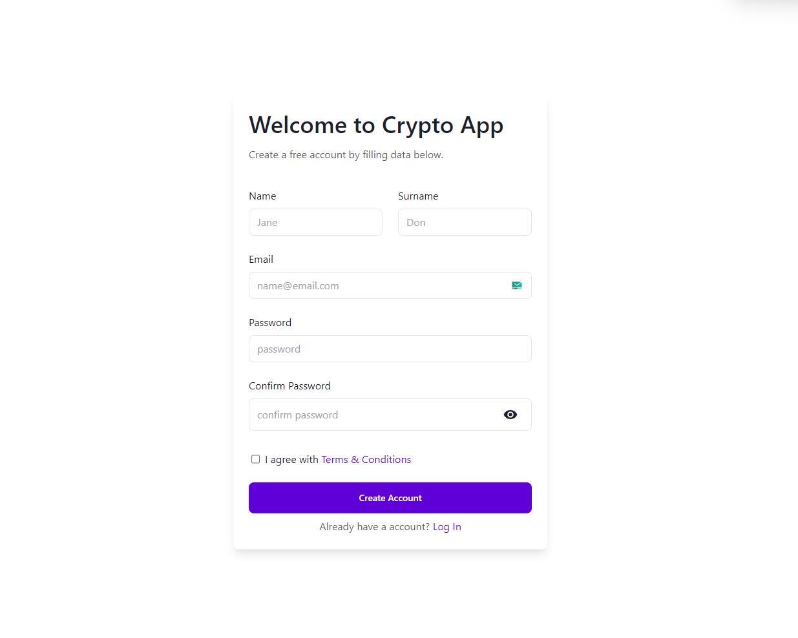

# Welcome! To 👋 Crypto Dashboard
    
  
  

# My Social medial

# Technologies used 
 

 

# My Learning 
 
  ### Further development
  - CurrentPrice component (time fix)
  - Learn about Cookies and JWT Authentication
  - Toast Message ( Feedback to Response )
  - Form Validation UI Improve 
  - Theme using Daisyui

  ### My Progress 
  - Support Dashboard
  - Main Dashboard
  - Transaction Dashboard
  - Authentication using JWT 
  - Authorization using cookies
  - Verifying Email And Forgot Password 

  ### TODO's

# Acknowledgments
[Do Some Coding]("https://www.https://www.youtube.com/@dosomecoding")

# Feedback for me 

# Useful Resources 

# Course 

## For Developers
    ## The challenge
    ## Clone Repo 
    ## Assets 
    ## Figma file 
    ## Share your project with me 
    ## Need Help from me 

**Have fun  Coding 🚀**
